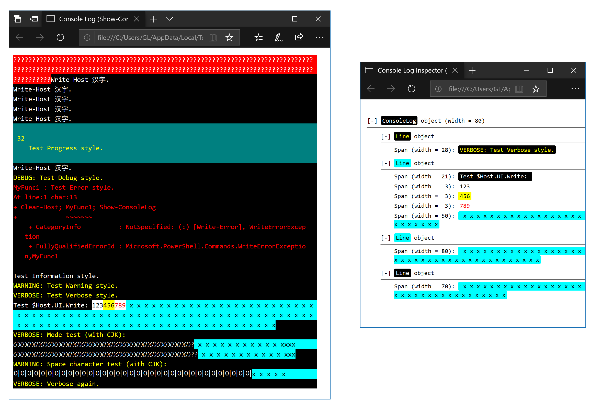

# Get-ConsoleLog

This module lets you save the console buffer to an object or an HTML file. It has the following cmdlets:

- `Get-ConsoleLog` creates a `ConsoleLog` object or formats it as HTML.
- `Show-ConsoleLog` saves the console log to a temporary HTML file and opens it in your default browser.

This module is based on [the techniques](https://devblogs.microsoft.com/powershell/capture-console-screen/) [presented](https://devblogs.microsoft.com/powershell/colorized-capture-of-console-screen-in-html-and-rtf/) in PowerShell blog.

## Install and Usage

```PowerShell
# To install this module for this PC.
#Requires -RunAsAdministrator
Install-Module -Name ConsoleLog

# To install this module for you.
Install-Module -Name ConsoleLog -Scope CurrentUser

# To save HTML of current console.
# It will ignore the line the cursor is at.
Get-ConsoleLog | Set-Content out.html

# Saves the console log to a temporary location and open it.
Show-ConsoleLog

# Include the current line of the cursor (useful if run non-interactively).
# Change format. More below.
Get-ConsoleLog -IncludeThisLine -Format Json | Out-Null

```

There is [an example](#example) with screenshot.

## `Get-ConsoleLog`

This cmdlet has the following parameters:

- `IncludeThisLine`: a switch controlling whether the line the cursor is at is included.
- `TrailingSpace`: one of `KeepAll`, `IgnoreAll`, and `IgnoreDefaultColors` (default), controlling how trailing space characters are handled.
- `Format`: one of `Html` (default), `Text`, `Json`, and `Object`, controlling the output format.
- `Css`: one of `Embed`, `Link`, and `None` (default), controlling how styles are presented (ignored if `Format` is not `Html`).
- `Concat`: a switch controlling whether the plain text output is returned as one single string as opposed to a stream of strings for each line (ignored if `Format` is not `Text`).
- `Compress`: a switch controlling whether the JSON output is minified (ignored if `Format` is not `Json`).

If `Format` is `Html` or `Json`, or if it is `Text` and `Concat` is on, the output is one single string. If `Format` is `Text` and `Concat` is off, the output consists of many strings, one for each line. If `Format` is `Object`, the output is one object of type `GeeLaw.ConsoleCapture.ConsoleLog`. The JSON output is simply this object converted to JSON.

## `Show-ConsoleLog`

This cmdlet has the following parameters:

- `IncludeThisLine`: a switch controlling whether the line the cursor is at is included.
- `TrailingSpace`: one of `KeepAll`, `IgnoreAll`, and `IgnoreDefaultColors` (default), controlling how trailing space characters are handled.
- `Interactive`: a switch controlling whether the output should be interactive.

## Example

```PowerShell
Function MyFunc2 {
Write-Verbose 'Test Verbose style.' -Verbose
$Host.UI.Write('White', 'Black', 'Test $Host.UI.Write: ')
$Host.UI.Write('Black', 'White', '123')
$Host.UI.Write('Black', 'Yellow', '456')
$Host.UI.Write('Red', 'White', '789')
$Host.UI.Write('Black', 'Cyan', ' x' * 100 + "`n")
}
Function MyFunc1 {
$Host.UI.Write('White', 'Red', '?' * 170)
1..10 | ForEach-Object { Write-Host 'Write-Host 汉字.' }
$Host.UI.WriteDebugLine('Test Debug style.')
Write-Error 'Test Error style.' -ErrorAction 'Continue'
Write-Information 'Test Information style.' -InformationAction 'Continue'
Write-Warning 'Test Warning style.' -WarningAction 'Continue'
MyFunc2
Write-Verbose 'Mode test (with CJK):' -vb
$Host.UI.Write('White', 'Black', 'の' * 26 + '?')
$Host.UI.Write('Black', 'Cyan', ' x' * 12 + 'xxx')
$Host.UI.Write('White', 'Black', 'の' * 26 + '??')
$Host.UI.Write('Black', 'Cyan', ' x' * 12 + 'xx')
Write-Warning 'Space character test (with CJK):'
$Host.UI.Write('White', 'Black', '어' * 35)
$Host.UI.Write('Black', 'Cyan', 'x ' * 5)
Write-Verbose 'Verbose again.' -Verbose
Write-Progress 32 -Status 'Test Progress style.'
Start-Sleep 1
}
# Run the following two lines separately.
Clear-Host; MyFunc1; Show-ConsoleLog
Clear-Host; MyFunc2; Show-ConsoleLog -Interactive
```


