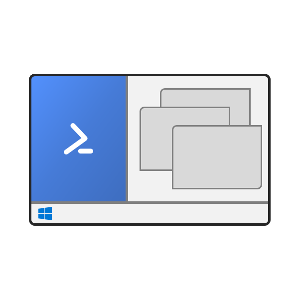

# Dock-PS



For documentation in English, see below.

简体中文的文档请向后翻。

## English

This is a nice utility that docks PowerShell on Windows to the primary screen. It turns the PowerShell console window into an Application Desktop Toolbar, by which the area occupied is turned into non-working area.

If you are not familiar with Application Desktop Toolbars, regard it as Taskbar. The Taskbar is an Application Desktop Toolbar, and when windows are maximised, they fill the working area, excluding that occupied by the Taskbar. With this module, you can make PowerShell console window Taskbar-ish. You can also compare this to Windows 8/8.1 application snapping. The Desktop and `CoreWindow`s of Windows Store apps occupy disjoint space of a screen, and when a desktop app is maximised, it does not cover the space allocated for a Windows Store app. Two common examples of Application Desktop Toolbar found in many Windows systems are Docking mode of Magnifier and OneNote Docked Window.

> However, the Windows 8/8.1 application snapping behaves differently from this module. The Taskbar is shrunk when a Windows Store app is also on the screen. And the snapping state is preserved even `explorer.exe` is restarted. Application Desktop Toolbars are discarded once `explorer.exe` is killed in Windows 10.

### Install

```PowerShell
PS> # To install this module for this PC
PS> #Requires -RunAsAdministrator
PS> Install-Module -Name Dock-PS

PS> # To install this module for you
PS> Install-Module -Name Dock-PS -Scope CurrentUser
```

### Usage

```PowerShell
PS> # Dock the console, use left/right/top/bottom
PS> # Move-Host -Position Right
PS> dock

PS> # Resize the docked console as percentage of screen size
PS> # Resize-Host -Both 45
PS> resize 45

PS> # Move the console
PS> # Move-Host -Position Top
PS> dock top

PS> # Undock the console
PS> # Pop-Host
PS> # Move-Host -Position Center
PS> undock
```

For detailed documentation, use `Get-Help`.

### Known issue(s)

- Docking multiple windows, especially when the total size is overwhelming, can cause problems in window sizing.
- Using this module to dock a console to the right might cause Action Center/notifications to fly in/out from the left on left-to-right UI.

## 简体中文

这是一个可以贴靠 Windows 上的 PowerShell 小玩意儿。它能把 PowerShell 控制台窗口变成一个应用桌面工具条，该窗口占据的区域将成为非工作区。

如果你不熟悉应用桌面工具条，你可以把它当成任务栏。任务栏是一个应用桌面工具条，窗口最大化的时占据的工作区域不包括任务栏。有了这个模块，你就可以把 PowerShell 控制台窗口变得像任务栏一样。你也可以把它类比于 Windows 8、8.1 的应用贴靠。桌面和 Windows 应用商店应用的 `CoreWindow`s 在屏幕上互不交叠，当桌面应用最大化时，Windows 应用商店应用不会被覆盖。很多 Windows 用户能够见到的两个应用桌面工具条是“贴靠”模式下的“放大镜”和 OneNote 的贴靠窗口。

> 注意，Windows 8、8.1 的应用贴靠功能和这个模块的功能不完全一样。当应用贴靠时，任务栏会缩短，并且即使重启 `explorer.exe` 贴靠状态也是保留的；在 Windows 10 中，一旦 `explorer.exe` 被终止，应用桌面工具条的状态就会消失。

### 安装

```PowerShell
PS> # 为这台电脑安装，需要管理员权限
PS> #Requires -RunAsAdministrator
PS> Install-Module -Name Dock-PS

PS> # 为自己安装
PS> Install-Module -Name Dock-PS -Scope CurrentUser
```

### 用法

```PowerShell
PS> # 贴靠控制台，可以选 left/right/top/bottom
PS> # Move-Host -Position Right
PS> dock

PS> # 设置控制台的大小是屏幕大小的百分之几
PS> # Resize-Host -Both 45
PS> resize 45

PS> # 移动控制台
PS> # Move-Host -Position Top
PS> dock top

PS> # 取消贴靠
PS> # Pop-Host
PS> # Move-Host -Position Center
PS> undock
```

可以用 `Get-Help` 查看详细文档。

### 已知问题

- 贴靠多个窗口（尤其是总大小很大时）可能导致窗口大小不正确。
- 使用这个模块贴靠控制台到右侧可能导致自左向右语言界面下通知中心、通知从左侧飞入飞出。

## License / 许可

The MIT License (MIT) / MIT 许可证

Copyright © 2017 by Gee Law

Permission is hereby granted, free of charge, to any person obtaining a copy of this software and associated documentation files (the “Software”), to deal in the Software without restriction, including without limitation the rights to use, copy, modify, merge, publish, distribute, sublicense, and/or sell copies of the Software, and to permit persons to whom the Software is furnished to do so, subject to the following conditions:

- The above copyright notice and this permission notice shall be included in all copies or substantial portions of the Software.

> THE SOFTWARE IS PROVIDED “AS IS”, WITHOUT WARRANTY OF ANY KIND, EXPRESS OR IMPLIED, INCLUDING BUT NOT LIMITED TO THE WARRANTIES OF MERCHANTABILITY, FITNESS FOR A PARTICULAR PURPOSE AND NONINFRINGEMENT. IN NO EVENT SHALL THE AUTHORS OR COPYRIGHT HOLDERS BE LIABLE FOR ANY CLAIM, DAMAGES OR OTHER LIABILITY, WHETHER IN AN ACTION OF CONTRACT, TORT OR OTHERWISE, ARISING FROM, OUT OF OR IN CONNECTION WITH THE SOFTWARE OR THE USE OR OTHER DEALINGS IN THE SOFTWARE.
