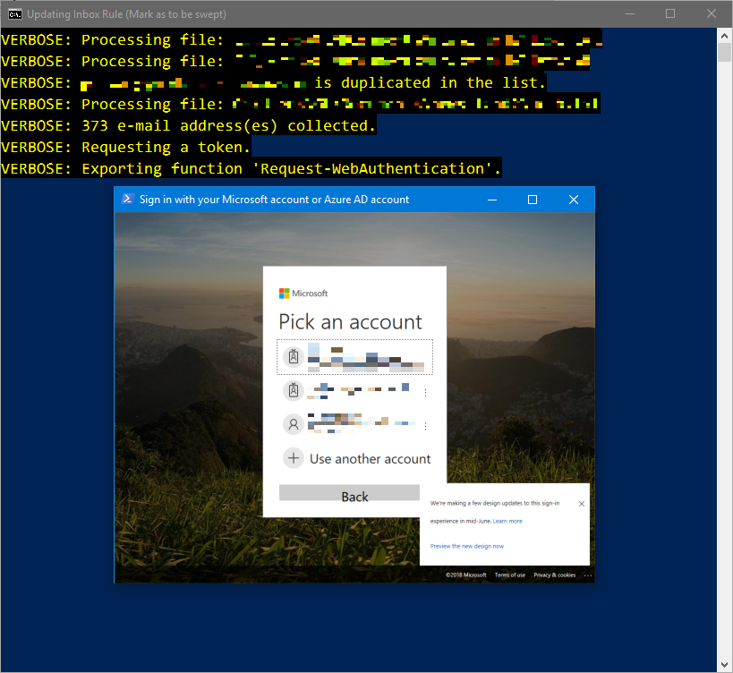

# WebAuthenticationBroker

This module provides an unified Web authentication broker. This module is available in PowerShell Gallery as `WebAuthenticationBroker`.

## Description

The `Request-WebAuthentication` advanced function displays an interactive UI to authenticate the user against some Web service. The UI used depends on the platform and can be tuned with parameters.

On Windows, it displays a window with web browser control inside by default.

On other platforms, it uses Start-Process to open the initial web page, then invokes the host UI to get the result. If `NoGui` parameter is switched on, the advanced function takes this path even if it is running on Windows.

> The following is a screenshot of how it looks like on Windows:
> 
> 
> 
> Note that the DPI scaling is awkward, due to not setting the site of `HTMLDocument` object. Improvement is coming soon.

## Parameters

### `InitialUri`

Specifies the initial URI to open. It must start with `http://` or `https://`.

- GUI on: the page is opened inside a window.
- GUI off: it is handled by Start-Process.

### `CompletionExtractor`

Specifies the completion extractor. The extractor should consume the URI using the pipeline variable `$_`, and should either return nothing (or `$null`), or something.

- GUI on: the extractor is called **after** each navigation of the hosted web browser.
- GUI off: it is called after the user pastes the final URI into the host. See `UriPredicate` parameter for more on GUI-disabled situation.

The extractor returning nothing (or `$null`) means no authentication information is extracted from the URI.

- GUI on: this means the GUI continues to wait for user interaction.
- GUI off: authentication fails.

The extractor returning something (other than `$null`) means some implementation-specific information has been extracted. Whatever returned by the extractor is written downstream in the pipeline, i.e., returned by the `Request-WebAuthentication` advanced function.

- GUI on: the GUI is dismissed and control is returned to PowerShell scripts for further processing.

It is advised to return information as soon as there is some result. Even if the result is failed authentication.

- GUI on: the window does not automatically dismiss itself until CompletionExtractor returns non-`$null`, and you should return non-`$null` if you can extract a failure from the URI, and add your error handling logic after the call to `Request-WebAuthentication` has returned.
- GUI off: it is okay to return `$null` if the URI contains an authentication failure, since it will never confuse the user. If you go for this scenario, you should always explicitly specify `NoGui` switch. However, it is stongly advised that you unify the two scenarios. Think the completion extractor as what is indicated by its name -- it finds when the authentication procedure has completed, not when the authentication procedure has succeeded.

### `UriPredicate`

Optionally specifies the URI predicate. The predicate should consume the URI using the pipeline variable `$_`, and should either return `$True` or `$False`.

- GUI on: the predicate is called **before** each navigation of the hosted web browser.
- GUI off: it is called after the user pastes the final URI into the host.

The predicate returning `$True` means the URI is allowed.

- GUI on: this means the navigation will happen.
- GUI off: this means processing can proceed.

The predicate returning `$False` means the URI is disallowed.

- GUI on: this means the navigation is cancelled, and the user stays on the last page.
- GUI off: this means processing is stopped.

If `UriPredicate` returns `$False`, the user will not succeed authentication, regardless of whether GUI is on or off. Specifically, if GUI is off, this predicate is checked before the extractor can be called.

One possible usage of this parameter is to prevent insecure pages when GUI is on. Note that if GUI is off, it is not guaranteed that the user not visit HTTP pages in-between, as only what is pasted into the host is checked.

### `Title`

Optionally specifies a title for the UI. If not provided, it falls back to a generic title.

- GUI on: this becomes the title of the authnetication broker window.
- GUI off: this is handed to the host. PowerShell host displays the title before the prompt.

### `TitleIsUri`

Sets the current URI as the title.

- GUI on: `Title` parameter, if set, is ignored, and the window title will always be the current URI.
- GUI off: this parameter is ignored, and `Title` parameter is used.

### `Prompt`

Optionally specifies a prompt for the UI. If not provided, it falls back to a generic prompt.

- GUI on: this parameter is ignored.
- GUI off: this parameter is handed to the host. PowerShell host displays the prompt after the title.

### `ErrorHandling`

Optionally specifies how the advanced function responds to authentication failures. Possible values are the following:

- `Silent`: simply returns nothing upon failure.
- `Write`: uses `$PSCmdlet.ThrowTerminatingError` and returns nothing upon failure.
- `Throw` (**default**): uses `Throw` keyword, which causes whatever follows the call to be aborted, until the thrown error record is caught by some surrounding `Try`-`Catch`(-`Finally`) block.

Note that even if the advanced function returns something, authentication might have failed. It just means `CompletionExtractor` has told the advanced function to proceed.

### `NoGui`

Prevents the advanced function from using GUI, and always makes it fall back to host-provided UI.

By default, the advanced function uses a window with hosted web browser in PowerShell for Windows.

In PowerShell for Windows, if this switch is on, `InitialUri` is opened with the user’s default web browser (HTTP/HTTPS URI protocol handler), and the user needs to paste the URI into the host after authentication to proceed.

In PowerShell Core, this switch is currently ignored.

## Output

Whatever is returned by the last call to CompletionExtractor.

## Example

```PowerShell
Write-Verbose 'Authenticating against Microsoft online services.';

$CLIENT_ID = 'your client id';
$REDIRECT_URI = 'https://login.microsoftonline.com/common/oauth2/nativeclient';
$REQUESTED_SCOPES = 'scopes to request';

$authUri = 'https://login.microsoftonline.com/common/oauth2/v2.0/authorize';
$authUri += "?client_id=$([uri]::EscapeDataString($CLIENT_ID))";
$authUri += '&response_type=code';
$authUri += "&redirect_uri=$([uri]::EscapeDataString($REDIRECT_URI))";
$authUri += "&scope=$([uri]::EscapeDataString($REQUESTED_SCOPES))";

$result = Request-WebAuthentication -InitialUri $authUri `
    -CompletionExtractor {
    If ($_.ToLowerInvariant().StartsWith($REDIRECT_URI + '?'))
    {
        Return ($_.Substring($REDIRECT_URI.Length + 1));
    }
} -Title 'Sign in with your Micorosft account or Azure AD account';
$result = "&$result&";

$errMatch = ([regex]'&[eE][rR][rR][oO][rR]=(.*?)&').Match($result);
If ($errMatch.Success)
{
    Throw ('Authentication failed: ' +
        [uri]::UnescapeDataString($errMatch.Groups[1].Value));
}

$codeMatch = ([regex]'&[cC][oO][dD][eE]=(.*?)&').Match($result);
If (-not $codeMatch.Success)
{
    Throw "Result URI does not contain code.";
}

$code = [uri]::UnescapeDataString($codeMatch.Groups[1].Value);
Write-Verbose "Acquired code: $code";
```

This example tries to authenticate the user against Microsoft services (e.g. Microsoft account and/or Azure AD accounts when using Microsoft Graph API). In PowerShell for Windows, the user is presented with a window with a hosted web browser inside. In PowerShell Core, the user has to paste the URI into the host. After the GUI/CLI is dismissed (completed or cancelled), the script proceeds to extract the code from the result URI. If the call to `Request-WebAuthentication` fails, the whole script will be aborted, which prevents errneous processing. If recovery is required, wrap the block with `Try`-`Catch`(-`Finally`).
